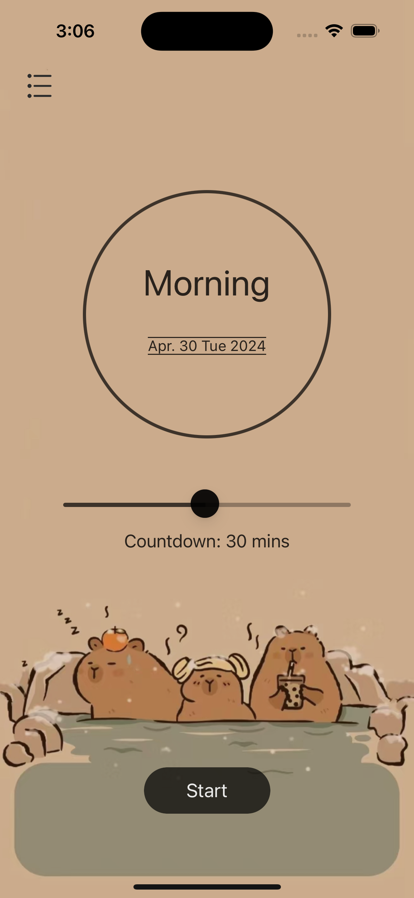
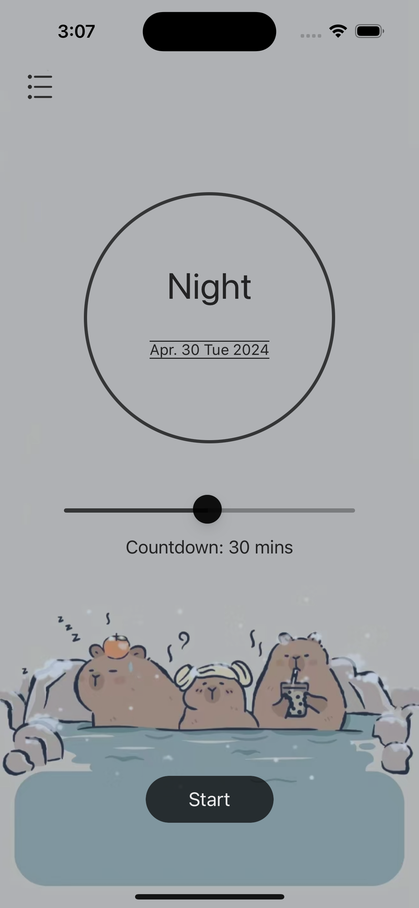
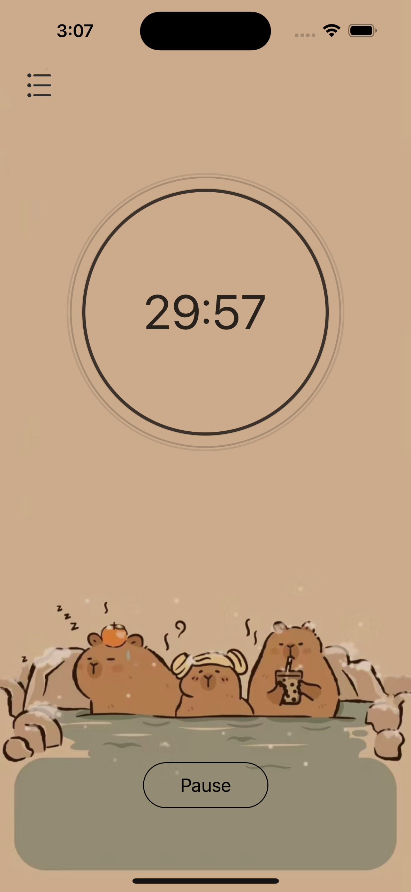
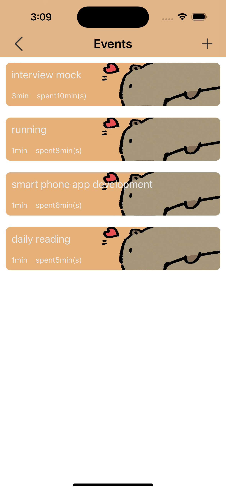
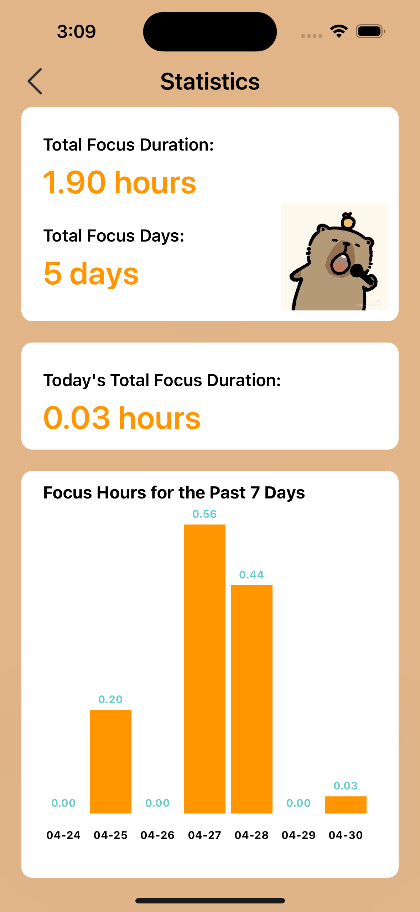
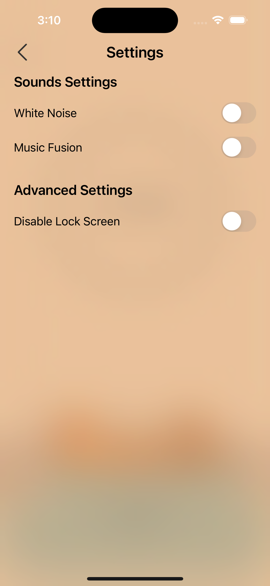

### Pomo Buddy

> An time management app running on the iOS platform.

##### Build

1. open it in Xcode and click the `Run` button.

If errors are generated, you can

1. install the `CocoaPods` (Dependency Manager) (Skip if already install)

2. delete the `Pods` folder

3. open terminal in the project root directory and run the following commands.

   ```shell
   pod install # Retrieve the pods for the project
   open PomoBuddy.xcworkspace
   ```

#### Screenshots

	 	

		

	
